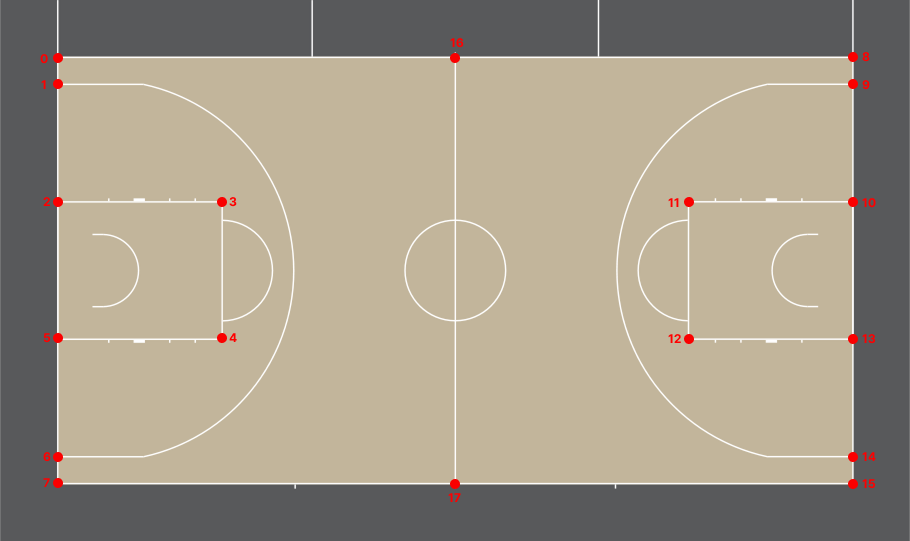
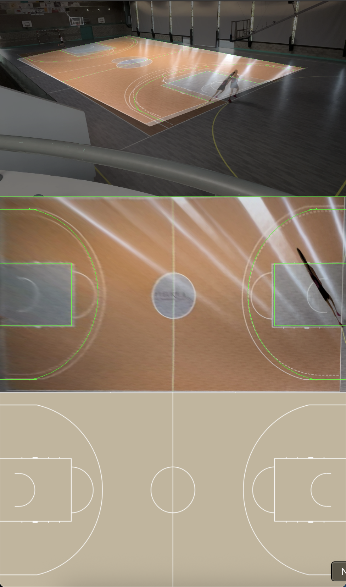

# Corpus
Valentin Woehrel - 2025

## 📊 Dataset

An evaluation dataset has been developed by Valentin Woehrel to assess the accuracy and performance of algorithms for calculating the distance traveled by basketball players. It includes:

- Video recordings of player movements
- Approximate player positions for each frame
- Ground truth distances traveled (in meters)

```
  .
  ├── eval_1.mov            — Video of the movement
  ├── eval_1_positions.csv  — Coordinates of each player on each frame
  ├── eval_1_distance.csv   — Distance traveled in real life
  ...
```

📁 [Access the dataset on Google Drive](https://drive.google.com/drive/folders/1TxdPJCvVeL86invfrzP5ipZW9437LR8l?usp=sharing)

## 🏛️ Architecture

This project is organized into the following directories:

```
  .
  ├── assets/  — Contains videos, extracted first frames, and schema illustrations
  ├── data/    — Stores coordinates of key frame points and schema reference data
  ├── models/  — Pre-trained models used for player detection
  ├── other/   — Miscellaneous Python scripts used for testing or experimentation
  ├── output/  — Output videos with player detection overlays
  └── saves/   — Detected player coordinates saved during processing
```


## 🔧 Install Dependencies
```bash
pip install -r requirements.txt
```


## First Frame

This script save the first frame of a video:
```bash
python first_frame_video.py "video_path"
```

## Point selection

Use this interactive tool to select key court points on the first frame:
```bash
python point_select.py "frame_path" "point_path"

or

python point_select.py "frame_path" "point_path" "point_index"  -> modify the given point only
```




## Run

### Show Homography

Display the application of homography in real time.

> 📌 **Note**: You can change the input video path directly in the script.

```bash
python court_line_video_fix.py
```



### Player detection

This script detects and tracks players in a video, then exports their coordinates (per frame) to a `.csv` file for further analysis.

> 📌 **Note**: You can configure the input and output paths directly in the script.

```bash
python main.py
```
